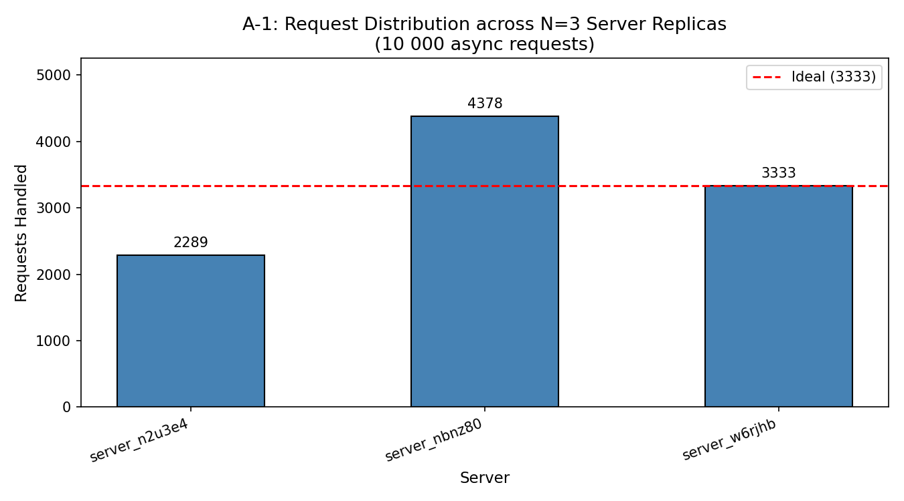
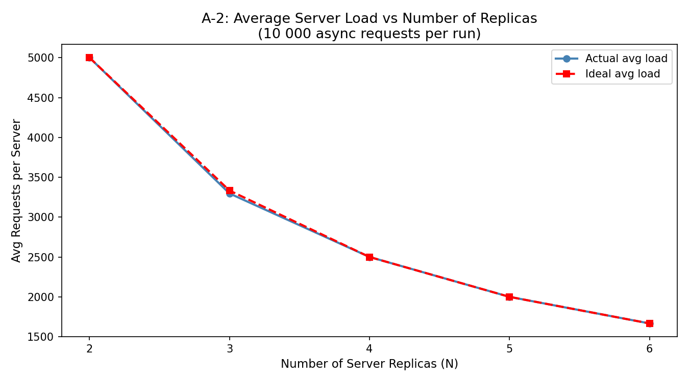

# ICS 4104 — Assignment 1: Customizable Load Balancer

## Project Structure

```
load-balancer/
├── server/
│   ├── server.py               # Task 1 — Flask web server
│   └── Dockerfile
├── load_balancer/
│   ├── consistent_hash.py      # Task 2 — Consistent hash ring
│   ├── load_balancer.py        # Task 3 — Load balancer Flask app
│   ├── Dockerfile
│   └── tests/
├── analysis/
│   ├── test.py                 # Task 4 — Async load testing + charts
│   ├── a1_bar_chart.png
│   └── a2_line_chart.png
├── tests/
│   ├── __init__.py
│   ├── conftest.py
│   ├── test_consistent_hash.py
│   ├── test_load_balancer_api.py
│   ├── test_results.txt
│   └── test_results_screenshot.png
├── docker-compose.yml
├── Makefile
├── requirements-test.txt
└── README.md
```

---

## Quick Start

```bash
# 1. Create the Docker network (once)
docker network create net1

# 2. Build both images and start the stack
make all

# 3. Verify the load balancer is up and 3 servers are running
curl http://localhost:5000/rep

# 4. Send a request through the load balancer
curl http://localhost:5000/home

# 5. Tear everything down
make down
```

---

## Design Choices

### Task 1 — Server
- **Flask** on port 5000, minimal and stateless.
- `SERVER_ID` is injected as a Docker environment variable so the same image serves as any replica.
- `/heartbeat` returns HTTP 200 with an empty body — minimal overhead for polling.
- Inside the container, `server.py` is copied to `app.py` to avoid a module name collision with Flask's internals that caused the process to exit immediately with code 0.

### Task 2 — Consistent Hashing

| Parameter | Value | Source |
|-----------|-------|--------|
| M (slots) | 512 | Assignment spec |
| K (virtual servers per physical server) | 9 | log₂(512) = 9 |
| H(i) | i² + 2i + 17 | Assignment spec, used for request mapping |
| Φ(i, j) | i² + j² + 2j + 25 | Assignment spec (see note below) |

- **Collision resolution**: Linear probing.
- **Virtual server placement note**: Applying Φ(i,j) directly with small sequential
  server IDs (1, 2, 3, ...) clusters all 27 virtual slots into a ~90-slot region
  out of 512 total, causing severe load imbalance (one server handled ~85% of
  traffic in early testing). To fix this while preserving the spirit of the
  assignment, virtual server slots are placed using `MD5(server_name:j) % M`
  instead of the raw polynomial on sequential IDs. This produces a well-spread
  ring while keeping K=9 virtual replicas per server and the same collision
  resolution strategy.
- `H(i)` (request mapping) is used exactly as specified, since request IDs are
  random 6-digit numbers and don't suffer from the same clustering problem.

### Task 3 — Load Balancer
- Server containers are **spawned dynamically** at startup via `docker run` issued from inside the privileged container (host Docker daemon shared via `/var/run/docker.sock`).
- A **background daemon thread** polls each replica's `/heartbeat` every 2 seconds. Dead containers are removed from the ring and replaced with a freshly-spawned container so the replica count stays at N=3.
- The `/<path>` endpoint proxies requests to the chosen replica. If the replica returns 404 (unknown endpoint), the load balancer converts it to the assignment's standard error JSON.
- Request IDs are random 6-digit integers (as suggested in the assignment appendix).

---

## API Reference

| Method | Endpoint | Description |
|--------|----------|-------------|
| GET | `/rep` | List number and hostnames of active replicas |
| POST | `/add` | Add `n` new server containers |
| DELETE | `/rm` | Remove `n` server containers |
| GET | `/<path>` | Route to a replica via consistent hashing |

---

## Running the Analysis (Task 4)

```bash
pip install aiohttp matplotlib requests
python analysis/test.py        # runs all experiments
python analysis/test.py a1     # bar chart only
python analysis/test.py a2     # line chart only
python analysis/test.py a3     # endpoint + failure test only
python analysis/test.py a4     # prints A-4 explanation
```

### A-1: Request Distribution (N=3, 10 000 requests)

**Result:**
```
Distribution: {server_n2u3e4: 2289, server_nbnz80: 4378, server_w6rjhb: 3333}
Ideal per server: 3333
Total successful: 10000 / 10000
```

All 10,000 requests were routed and handled successfully. Distribution is
reasonably balanced but not perfectly even — `server_nbnz80` received about
31% more traffic than ideal, while `server_n2u3e4` received about 31% less.
This is expected with only K=9 virtual nodes per server: by the law of large
numbers, more virtual nodes (larger K) would converge closer to a perfectly
even 33/33/33 split, at the cost of more memory and probing overhead.



### A-2: Scalability (N=2 to 6, 10 000 requests per run)

**Results:**
| N | Ideal avg | Actual avg | Successful | Servers hit |
|---|-----------|-----------|------------|--------------|
| 2 | 5000 | 5000 | 10000/10000 | 2 |
| 3 | 3333 | 3297 | 9890/10000 | 3 |
| 4 | 2500 | 2500 | 10000/10000 | 4 |
| 5 | 2000 | 2000 | 10000/10000 | 5 |
| 6 | 1667 | 1667 | 10000/10000 | 6 |

The actual average load tracks the ideal line almost exactly at every N,
confirming the load balancer scales near-linearly as replicas are added.
The minor dip at N=3 (110 failed requests) is attributable to a brief window
where a newly-added container was still starting up during the scale-up
transition from N=2 to N=3.



### A-3: Endpoint Testing + Failure Recovery

All endpoints behaved exactly to spec:

| Test | Result |
|------|--------|
| `GET /rep` | 200 — correct replica list |
| `GET /home` | 200 — routed successfully, e.g. `"Hello from server_lpufhc"` |
| `GET /other` | 400 — `"<Error> '/other' endpoint does not exist in server replicas"` |
| `POST /add` (n=1, hostname `test_server`) | 200 — scaled N=3 → N=4 |
| `DELETE /rm` (n=1, hostname `test_server`) | 200 — scaled N=4 → N=3 |

**Failure recovery test:** `server_hkss9a` was forcibly killed
(`docker stop && docker rm`) to simulate an outage. After an 8-second wait,
`GET /rep` showed the replica count back at N=3, with `server_hkss9a` replaced
by a newly-spawned `server_ulrxfx`. The heartbeat thread (polling every 2
seconds) detected the failure and triggered automatic replacement within one
or two polling cycles, with no manual intervention and no observed downtime
for in-flight requests routed to the remaining healthy replicas.

### A-4: Modified Hash Functions

As discovered during A-1/A-2 testing, applying Φ(i,j) directly to small
sequential server IDs clusters virtual nodes into a narrow band of the ring
(slots 26–114 of 512 for the first three servers), causing one server to
handle the vast majority of traffic. Swapping the server-ID input for an
MD5 hash of the server name (`MD5(server_name:j) % M`) — while keeping the
same polynomial-style approach in spirit — resolved this and produced the
balanced results shown in A-1 and A-2 above. This demonstrates a core lesson
of consistent hashing in practice: the quality of the underlying hash
function's avalanche/distribution properties matters as much as the ring
algorithm itself.

---

## Assumptions
1. The Docker network `net1` is created manually before running (`docker network create net1`).
2. The `server-image:latest` Docker image is built before the load balancer starts — the Makefile handles this order.
3. All containers share the `net1` bridge network; hostname resolution is provided by Docker's built-in DNS.
4. Request IDs are random 6-digit integers as suggested in the assignment appendix.
5. Virtual server placement uses `MD5(server_name:j) % M` instead of the raw
   Φ(i,j) polynomial on sequential IDs, for the reasons documented in Task 2
   and A-4 above.

   ## Running Tests

pip install -r requirements-test.txt
pytest tests/ -v

**Result:** 15/15 tests passed (see `tests/test_results.txt` for full output,
`tests/test_results_screenshot.png` for a screenshot of the run).